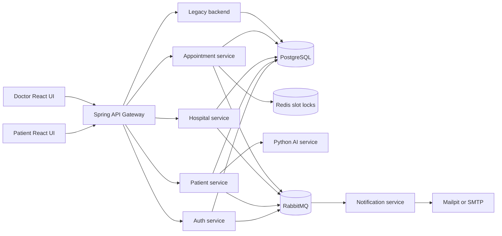
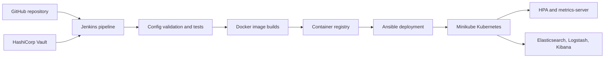

# SwasthyaSetu

SwasthyaSetu ("Health Bridge") is a healthcare appointment and patient-record
platform built around Spring Boot microservices. It provides separate patient
and doctor experiences, OTP-based authentication, appointment booking,
QR-controlled record access, asynchronous notifications, and a complete local
DevOps path from Docker Compose to Kubernetes.

## Product highlights

- Patient registration and time-limited OTP authentication.
- Hospital and doctor discovery with appointment scheduling.
- Redis-backed slot locks that prevent concurrent double booking.
- QR-based appointment verification before medical-record access or
  prescription upload.
- Audit records for QR scans and patient-record access.
- RabbitMQ events for OTP, registration, appointment, hospital, and doctor
  workflows.
- Patient and doctor React applications behind a Spring Cloud API Gateway.
- Docker Compose development stack with PostgreSQL, Redis, RabbitMQ, Mailpit,
  and a Python AI service.
- Jenkins, Docker, Ansible, Minikube, Kubernetes HPA, HashiCorp Vault, and ELK
  deployment support.

## Architecture



Both React applications send requests through the API Gateway. Domain services
own authentication, patients, hospitals, appointments, and notifications.
PostgreSQL stores operational data, Redis serializes competing appointment
requests, and RabbitMQ distributes domain events without coupling producers to
email delivery or downstream read models. The patient service also calls the
Python AI service for prescription processing.

## Delivery architecture



The pipeline validates configuration, tests Java services, builds both
frontends, checks the AI service, builds and publishes images, deploys the stack
to Minikube through Ansible, and injects SMTP configuration from Vault.

## Services

| Component | Default port | Responsibility |
| --- | ---: | --- |
| `api-gateway` | `8080` | Public routing and JWT-aware API entry point |
| `auth-service` | `8081` | Patient/doctor OTP and authentication flow |
| `patient-service` | `8082` | Patient profiles, history, QR audit, prescriptions |
| `appointment-service` | `8083` | Booking, slots, QR validation, Redis locking |
| `hospital-service` | `8084` | Hospital and doctor information |
| `notification-service` | `8086` | RabbitMQ consumers and email notifications |
| `backend` | `8090` | Legacy/transition backend capabilities |
| `ai-service` | `8000` | Python prescription-processing service |
| `swasthya-frontend` | `5173` | Patient web application |
| `doctor-frontend` | `5174` | Doctor web application |

## Technology

| Layer | Stack |
| --- | --- |
| Frontend | React 19, JavaScript, Vite 8, Tailwind CSS, React Router, Axios |
| Services | Java 21, Spring Boot 4, Spring Web, Spring Data JPA |
| Gateway and security | Spring API Gateway, JWT, CORS configuration |
| Data and messaging | PostgreSQL 16, Redis 7, RabbitMQ 3 |
| AI | Python service |
| Local email | Mailpit; external SMTP can be configured |
| Delivery | Jenkins, Docker, Docker Compose, Ansible |
| Orchestration | Kubernetes, Minikube, Kustomize, HPA |
| Secrets and observability | HashiCorp Vault, Elasticsearch, Logstash, Kibana |

## Quick start with Docker Compose

### Prerequisites

- Git
- Docker Desktop with Docker Compose
- `curl` for the health-check script

Clone and start the complete local stack:

```bash
git clone git@github.com:Aditya01237/SwasthyaSetu.git
cd SwasthyaSetu
cp .env.example .env
docker compose up -d --build
```

Wait for every application to become ready:

```bash
sh scripts/ci/health-check.sh
```

### Local URLs

| Application | URL |
| --- | --- |
| Patient application | `http://localhost:5173/patient/` |
| Doctor application | `http://localhost:5174/doctor/` |
| API Gateway health | `http://localhost:8080/actuator/health` |
| Mailpit inbox | `http://localhost:18025` |
| RabbitMQ management | `http://localhost:15672` |

Mailpit captures OTP and appointment emails locally, so Gmail credentials are
not required for the default Compose workflow.

Stop the stack without deleting persistent volumes:

```bash
docker compose down
```

## Configuration

Copy `.env.example` to `.env` and override only the values needed for your
environment. Important groups include:

- PostgreSQL credentials and service JDBC URLs.
- Redis and RabbitMQ ports and credentials.
- public ports for the gateway, services, and frontends.
- `JWT_SECRET` and allowed frontend origins.
- `NOTIFICATION_MAIL_*` values when replacing Mailpit with external SMTP.
- container registry, tag, ELK, and local CI stack settings.

The default Compose profile uses one PostgreSQL instance and the
`swasthyasetudb` database. `docker-compose.service-dbs.yml` can be layered in to
test service-specific logical databases such as `auth_db`, `patient_db`,
`appointment_db`, and `hospital_db`.

Do not commit `.env`, Vault tokens, SMTP passwords, or registry credentials.

## Verification

Validate Compose/Kubernetes configuration:

```bash
sh scripts/ci/validate-config.sh
```

Run the Java service checks:

```bash
sh scripts/ci/test-java-services.sh
```

Build both React applications:

```bash
sh scripts/ci/build-frontends.sh
```

Check a running Compose stack:

```bash
sh scripts/ci/health-check.sh
```

## Core flows

### OTP authentication

1. A patient or doctor requests an OTP through the gateway.
2. `auth-service` stores an expiring verification record.
3. An `auth.otp-requested` event is published to RabbitMQ.
4. `notification-service` consumes the event and sends the message through
   Mailpit or the configured SMTP provider.
5. Successful verification allows the authenticated workflow to continue.

### Appointment booking

1. The patient selects a hospital, doctor, date, and time slot.
2. `appointment-service` obtains a short-lived Redis lock for that slot.
3. The appointment is persisted only when the slot remains available.
4. An appointment event updates downstream read models and notifications.
5. The patient receives booking details and a QR token.

### QR-controlled medical access

1. The doctor scans the appointment QR code.
2. `appointment-service` validates the appointment and doctor relationship.
3. `patient-service` records a `QR_SCAN` audit event.
4. Prescription upload and related medical-record operations are unlocked for
   the validated appointment.

## Kubernetes and Ansible

Recommended local Minikube resources are at least 6 CPUs and 9 GB of memory.

```bash
minikube start --driver=docker --cpus=6 --memory=9000
minikube addons enable ingress
minikube addons enable metrics-server
sh scripts/ci/deploy-ansible-minikube-k8s.sh
```

Verify the deployment:

```bash
sh scripts/ci/health-check-k8s.sh
kubectl get pods -n swasthya-setu
kubectl top pods -n swasthya-setu
```

The manifests under `k8s/` define application deployments, infrastructure,
ingress, autoscaling, observability, and the `swasthya-setu` namespace. Ansible
provides repeatable local Minikube and remote Compose deployment playbooks.

## Vault and external SMTP

The default local stack uses Mailpit. For a Kubernetes demo with real SMTP,
start the Vault overlay and store credentials outside the repository:

```bash
docker compose -f docker-compose.yml -f docker-compose.vault.yml up -d vault
export VAULT_ADDR=http://localhost:18200
export VAULT_TOKEN=your-local-vault-token
vault kv put secret/swasthya-setu/smtp \
  SPRING_MAIL_USERNAME="your-email@example.com" \
  SPRING_MAIL_PASSWORD="your-app-password" \
  SPRING_MAIL_HOST="smtp.example.com" \
  SPRING_MAIL_PORT="587"
```

The Jenkins stage `Apply SMTP Secrets From Vault` reads these values and updates
the Kubernetes Secret consumed by `notification-service`. The included Vault
profile is intended for local demonstrations, not production operation.

## Observability

Start the ELK overlay with the application stack:

```bash
docker compose \
  -f docker-compose.yml \
  -f docker-compose.observability.yml \
  up -d
```

| Tool | Default URL/port | Purpose |
| --- | --- | --- |
| Elasticsearch | `http://localhost:9200` | Stores indexed logs |
| Kibana | `http://localhost:5601` | Searches and visualizes logs |
| Logstash | GELF `12201`, API `9600` | Receives and transforms service logs |

For Kubernetes resource metrics, use `kubectl top pods -n swasthya-setu` after
enabling `metrics-server`.

## Jenkins pipeline

The root `Jenkinsfile` contains these primary stages:

1. Checkout and configuration validation.
2. Parallel Java service tests.
3. Patient and doctor frontend builds.
4. Python AI-service validation.
5. Vault preparation.
6. Docker image build and registry publication.
7. Ansible-driven Minikube deployment.
8. SMTP Secret injection from Vault.

Jenkins requires appropriately scoped registry and Vault credentials. Use the
credential IDs documented in the pipeline parameters instead of placing secrets
in source-controlled files.

## Repository layout

```text
services/
  api-gateway/          Public API routing
  auth-service/         OTP and authentication
  patient-service/      Patients, records, QR audit
  appointment-service/  Booking, slots, Redis locks, QR validation
  hospital-service/     Hospitals and doctors
  notification-service/ RabbitMQ-driven email delivery
  backend/              Legacy transition service
  ai-service/           Python AI API
swasthya-frontend/      Patient React application
doctor-frontend/        Doctor React application
docker/                 PostgreSQL and Logstash support files
k8s/                    Kubernetes and Kustomize manifests
ansible/                Deployment inventories and playbooks
scripts/ci/             Validation, build, deploy, and health scripts
scripts/local/          Demo seeding and port-forward helpers
docs/                   Reports, architecture notes, and runbooks
Jenkinsfile             CI/CD pipeline
docker-compose.yml      Complete local application stack
```

## Demo data

After a fresh Kubernetes deployment, seed the demonstration databases with:

```bash
sh scripts/local/seed-demo-database.sh
```

For local access to Kubernetes services, run:

```bash
sh scripts/local/port-forward-demo.sh
```

Detailed deployment notes, rubric mapping, and troubleshooting material remain
available under `docs/`, `k8s/README.md`, and `ansible/README.md`.
