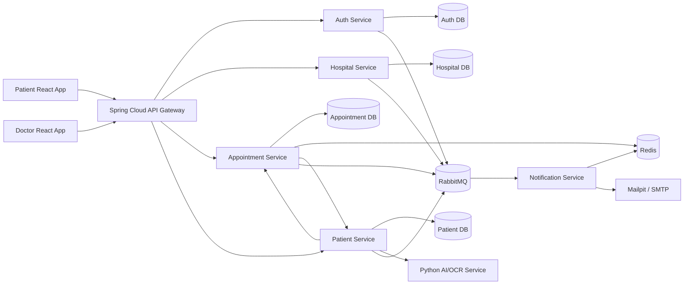
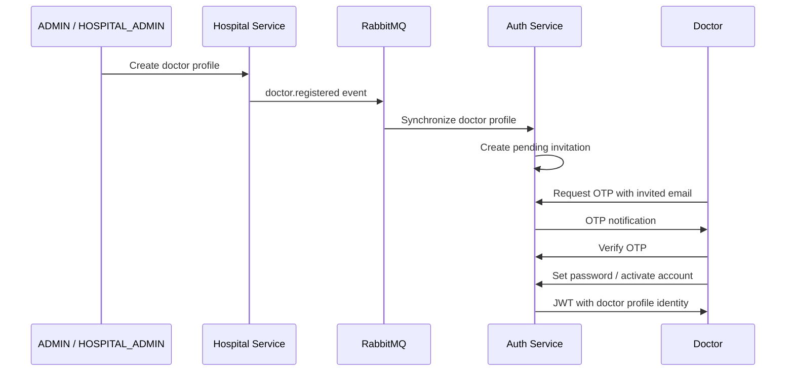
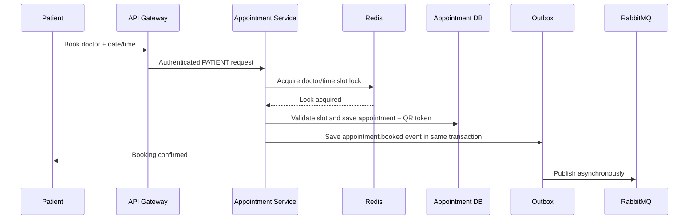

# SwasthyaSetu

SwasthyaSetu ("Health Bridge") is a healthcare platform for digital appointment booking, unified patient records, controlled doctor access, and reliable asynchronous notifications.

The system is built as Spring Boot microservices behind a Spring Cloud API Gateway, with React applications for patients and doctors, PostgreSQL for service data, Redis for slot locking and idempotency, RabbitMQ for domain events, and Kubernetes for deployment and scaling.

The current architecture has been hardened around authentication, authorization, database ownership, event reliability, internal-service isolation, and production deployment.

## What the platform provides

- Patient registration and OTP-based authentication.
- Hospital and doctor discovery.
- Appointment booking with Redis-backed protection against double booking.
- Invitation-only doctor onboarding managed by hospital administrators.
- `ADMIN` and hospital-scoped `HOSPITAL_ADMIN` authorization.
- Unified patient medical history and prescription storage.
- QR-based, time-limited access to patient records for the assigned doctor.
- Audit logs for QR scans and clinical-record access.
- Asynchronous OTP, registration, appointment, hospital, and doctor events through RabbitMQ.
- Transactional Outbox delivery with retry/DLQ handling.
- Redis-backed notification idempotency to avoid duplicate email delivery.
- Local QR generation with ZXing so access tokens are not sent to a third-party QR service.
- Python OCR/prescription processing that fails closed unless explicit demo mode is enabled.
- Docker Compose for local development and Kubernetes/Kustomize for deployment.
- GitHub Actions, Jenkins, Ansible, Prometheus/Grafana, and ELK support.

---

## Architecture


```mermaid
flowchart LR
    PatientUI[Patient React App] --> Gateway[Spring Cloud API Gateway]
    DoctorUI[Doctor React App] --> Gateway

    Gateway --> Auth[Auth Service]
    Gateway --> Hospital[Hospital Service]
    Gateway --> Appointment[Appointment Service]
    Gateway --> Patient[Patient Service]

    Auth --> AuthDB[(Auth DB)]
    Hospital --> HospitalDB[(Hospital DB)]
    Appointment --> AppointmentDB[(Appointment DB)]
    Patient --> PatientDB[(Patient DB)]

    Appointment --> Redis[(Redis)]
    Notification --> Redis

    Appointment --> Patient
    Patient --> Appointment
    Patient --> AI[Python AI/OCR Service]

    Auth --> RabbitMQ[(RabbitMQ)]
    Hospital --> RabbitMQ
    Appointment --> RabbitMQ
    Patient --> RabbitMQ

    RabbitMQ --> Notification[Notification Service]
    Notification --> SMTP[Mailpit / SMTP]
```

All browser traffic enters through the API Gateway. The gateway validates JWTs and rebuilds trusted identity headers before forwarding the request to a domain service.

In the deployment architecture, each domain service owns its database. For a simpler local setup, the default Compose file can point the services to one PostgreSQL database; `docker-compose.service-dbs.yml` can be layered on top to use separate logical databases such as `auth_db`, `patient_db`, `appointment_db`, and `hospital_db`.

The historical `services/backend` source directory may still exist in the repository for reference, but it is not part of the active runtime: it is not routed by the gateway, started by the default Compose stack, rendered as a Kubernetes Service/Deployment, or scraped as an active application service.

---

## Services

| Component | Internal port | Responsibility |
| --- | ---: | --- |
| `api-gateway` | `8080` | Public API entry point, JWT validation, trusted identity propagation |
| `auth-service` | `8081` | Patient OTP auth, doctor credentials/invitations, admin authentication |
| `patient-service` | `8082` | Patient profiles, medical history, prescriptions, QR audit |
| `appointment-service` | `8083` | Appointments, slot locking, QR token lifecycle and access checks |
| `hospital-service` | `8084` | Hospitals, doctor profiles and hospital-scoped management |
| `notification-service` | `8086` | RabbitMQ consumers, QR email generation and idempotent notifications |
| `ai-service` | `8000` | Prescription OCR/processing API |
| `swasthya-frontend` | `5173` host | Patient web application |
| `doctor-frontend` | `5174` host | Doctor web application |

Only the API Gateway and the two frontends are published to the host by the default Compose stack. Databases, Redis, RabbitMQ, AI, and individual microservice ports stay internal to the Docker network.

For direct debugging, use `docker-compose.dev-ports.yml` explicitly.

---

## Security model

### JWT identity

After authentication, the API Gateway validates the JWT and removes caller-supplied identity headers before rebuilding trusted headers such as:

```text
X-User-Id
X-User-Role
X-Hospital-Id   # when applicable
```

Domain services authorize requests using those trusted values rather than IDs sent in request bodies or query parameters.

Examples:

- A patient cannot request another patient's appointments by changing a UHID parameter.
- A doctor cannot request another doctor's appointment details by changing a doctor ID.
- A QR scan is checked against the authenticated doctor and the appointment assigned to that doctor.
- A `HOSPITAL_ADMIN` can manage only the hospital carried in the trusted JWT hospital claim.

### Roles

The platform supports these important roles:

```text
PATIENT
DOCTOR
HOSPITAL_ADMIN
ADMIN
```

`ADMIN` is the global administrative role. `HOSPITAL_ADMIN` is scoped to one hospital.

The root admin is bootstrap-only and can be created from deployment secrets/environment variables. There is no public root-admin signup flow.

### Credential ownership

Doctor passwords are owned only by `auth-service` and stored with BCrypt.

Patient, appointment, and hospital read models do not store doctor passwords. Flyway migrations physically remove legacy password columns from those service schemas.

---

## Doctor onboarding

Doctor creation is invitation-based rather than public self-registration.


```mermaid
sequenceDiagram
    participant Admin as ADMIN / HOSPITAL_ADMIN
    participant Hospital as Hospital Service
    participant MQ as RabbitMQ
    participant Auth as Auth Service
    participant Doctor as Doctor

    Admin->>Hospital: Create doctor profile
    Hospital->>MQ: doctor.registered event
    MQ->>Auth: Synchronize doctor profile
    Auth->>Auth: Create pending invitation
    Doctor->>Auth: Request OTP with invited email
    Auth->>Doctor: OTP notification
    Doctor->>Auth: Verify OTP
    Doctor->>Auth: Set password / activate account
    Auth->>Doctor: JWT with doctor profile identity
```

The hospital service owns the doctor profile identity. Auth service owns the login account. These are intentionally separate identities; the doctor JWT uses the hospital-owned profile ID because appointments reference that doctor profile.

---

## Appointment booking flow


```mermaid
sequenceDiagram
    participant P as Patient
    participant G as API Gateway
    participant A as Appointment Service
    participant R as Redis
    participant DB as Appointment DB
    participant O as Outbox
    participant MQ as RabbitMQ

    P->>G: Book doctor + date/time
    G->>A: Authenticated PATIENT request
    A->>R: Acquire doctor/time slot lock
    R-->>A: Lock acquired
    A->>DB: Validate slot and save appointment + QR token
    A->>O: Save appointment.booked event in same transaction
    A-->>P: Booking confirmed
    O->>MQ: Publish asynchronously
```

Redis protects the critical booking window from concurrent requests. The database remains the durable source of truth, while the outbox guarantees that successful business transactions are not silently separated from their domain events.

---

## QR-controlled medical access

A QR token is created for an appointment and is valid only around the appointment time.

Current window:

```text
validFrom = appointmentTime - 1 hour
validTo   = appointmentTime + 1 hour
```

For example, a `1:00 PM` appointment produces a QR access window from `12:00 PM` to `2:00 PM`.

The QR request contains only the QR token. Doctor identity comes from the validated JWT.

The server verifies:

1. the QR token exists;
2. it is inside its time window;
3. it has not already been consumed when single-use semantics apply;
4. the QR belongs to an appointment assigned to the authenticated doctor;
5. the internal patient-record request carries the internal service credential.

The patient service records the corresponding audit information when clinical data is accessed.

---

## OTP protection

Authentication OTPs use `SecureRandom` and include abuse controls:

- configurable OTP lifetime;
- resend cooldown;
- configurable maximum failed attempts;
- persisted failed-attempt counters;
- invalidation of expired or exhausted OTP records.

OTP notifications are emitted through the event pipeline instead of tightly coupling authentication logic to email delivery.

---

## Messaging reliability

RabbitMQ carries domain events including OTP, patient registration, appointments, hospitals, and doctor-profile changes.

### Transactional Outbox

`auth-service`, `patient-service`, `hospital-service`, and `appointment-service` write outbound events to an `outbox_events` table in the same database transaction as the business change.

Dispatchers later publish pending events to RabbitMQ.

For horizontal scaling, outbox batches are claimed with PostgreSQL locking using `FOR UPDATE SKIP LOCKED`, preventing multiple service replicas from simultaneously dispatching the same pending row.

### Stable event identity

Published events carry a stable RabbitMQ `messageId` derived from the outbox event identity.

### Retry and dead-letter queues

Consumers use bounded retries with backoff. Messages that continue to fail are routed to durable DLQs instead of being silently acknowledged and lost.

### Notification idempotency

RabbitMQ provides at-least-once delivery, so duplicate delivery is possible. `notification-service` uses Redis `SETNX`-style idempotency keys based on the event ID before sending email.

A successful notification retains the deduplication key for a TTL. If processing fails, the claim is released so RabbitMQ retry/DLQ behavior can continue.

---

## Database migrations

Schema ownership is handled with Flyway for the database-owning services:

```text
auth-service
patient-service
appointment-service
hospital-service
```

Hibernate uses:

```properties
spring.jpa.hibernate.ddl-auto=validate
```

That means Hibernate validates the mapped schema, while Flyway is responsible for creating and evolving it.

CI also applies the migrations against fresh PostgreSQL databases and verifies that doctor credential columns exist only where they belong.

---

## AI / prescription processing

`patient-service` can send prescription input to the Python AI/OCR service.

Production behavior is fail-closed: OCR/dependency/processing failures return an error rather than silently substituting fake medical information.

A mock fallback is available only when demo mode is explicitly enabled:

```text
AI_DEMO_MODE=true
```

Raw prescription/OCR text is not written to application logs.

---

## Technology stack

| Area | Technology |
| --- | --- |
| Frontend | React, JavaScript, Vite, Tailwind CSS, React Router, Axios |
| Backend | Java 21, Spring Boot 4, Spring Data JPA |
| Gateway | Spring Cloud Gateway, JWT |
| Database | PostgreSQL 16, Flyway |
| Cache / coordination | Redis 7 |
| Messaging | RabbitMQ 3, transactional outbox, DLQ |
| QR | ZXing |
| AI/OCR | Python service |
| Local email | Mailpit |
| Containers | Docker, Docker Compose |
| Orchestration | Kubernetes, Kustomize, HPA, PDB, NetworkPolicy |
| Delivery | GitHub Actions, Jenkins, Ansible |
| Observability | Prometheus/Grafana, Elasticsearch, Logstash, Kibana |
| Secrets | Kubernetes Secrets; Vault-supported delivery workflow |

---

## Quick start with Docker Compose

### Prerequisites

- Git
- Docker Desktop / Docker Engine
- Docker Compose

Clone the repository:

```bash
git clone https://github.com/Aditya01237/SwasthyaSetu.git
cd SwasthyaSetu
```

For the simplest local stack, Docker Compose defaults are enough:

```bash
docker compose up -d --build
```

The default stack publishes only:

| Application | URL |
| --- | --- |
| Patient app | `http://localhost:5173/patient/` |
| Doctor app | `http://localhost:5174/doctor/` |
| API Gateway | `http://localhost:8080` |
| Gateway health | `http://localhost:8080/actuator/health` |

Internal infrastructure and service ports are intentionally not published.

### Debug ports

When you explicitly need direct access to PostgreSQL, Redis, RabbitMQ management, Mailpit, AI, or the individual services, layer the development-port file:

```bash
docker compose \
  -f docker-compose.yml \
  -f docker-compose.dev-ports.yml \
  up -d --build
```

Common debug URLs then include:

| Component | Default host endpoint |
| --- | --- |
| Mailpit UI | `http://localhost:18025` |
| RabbitMQ management | `http://localhost:15672` |
| Auth service | `http://localhost:8081` |
| Patient service | `http://localhost:8082` |
| Appointment service | `http://localhost:8083` |
| Hospital service | `http://localhost:8084` |
| Notification service | `http://localhost:8086` |
| AI service | `http://localhost:8000` |

Stop containers while preserving volumes:

```bash
docker compose down
```

---

## Configuration

The repository includes `.env.example` for optional overrides. Docker Compose already supplies development defaults for many values, so copy/edit the file only when you need explicit configuration.

Important production-sensitive values include:

```text
POSTGRES_USER / POSTGRES_PASSWORD
RABBITMQ_DEFAULT_USER / RABBITMQ_DEFAULT_PASS
JWT_SECRET
INTERNAL_SERVICE_TOKEN
APP_BOOTSTRAP_ADMIN_EMAIL
APP_BOOTSTRAP_ADMIN_PASSWORD
SMTP credentials
```

Never deploy using the development placeholder JWT/internal-service/database/messaging credentials.

Do not commit real `.env` files, Vault tokens, SMTP passwords, TLS private keys, or registry credentials.

### Service-owned databases locally

To test the logical database-per-service model:

```bash
docker compose \
  -f docker-compose.yml \
  -f docker-compose.service-dbs.yml \
  up -d --build
```

This allows the services to use databases such as:

```text
auth_db
patient_db
appointment_db
hospital_db
```

---

## Internal service calls

Internal patient/appointment APIs are not intended to be public application APIs.

They require an internal service credential:

```text
X-Internal-Service-Token
```

The token is supplied through Docker/Kubernetes configuration and attached by trusted service clients. Default Compose also keeps those services off host ports, providing a second layer of isolation.

Explicit connect/read timeouts are configured for internal HTTP calls so a failed downstream service cannot block request threads indefinitely.

---

## Kubernetes

The base Kubernetes manifests live in:

```text
k8s/
```

A hardened production-oriented Kustomize overlay lives in:

```text
k8s-production/
```

The production overlay adds controls including:

- default-deny ingress NetworkPolicy;
- explicit same-namespace communication;
- NGINX ingress access to public entry points;
- production HPA limits;
- PodDisruptionBudgets;
- HTTPS redirect/TLS configuration.

RabbitMQ uses persistent storage so durable queues survive pod recreation.

For a local Minikube deployment:

```bash
minikube start --driver=docker --cpus=6 --memory=9000
minikube addons enable ingress
minikube addons enable metrics-server
sh scripts/ci/deploy-ansible-minikube-k8s.sh
```

Useful verification commands:

```bash
kubectl get pods -n swasthya-setu
kubectl top pods -n swasthya-setu
kubectl kustomize k8s > /tmp/swasthya-base.yaml
kubectl kustomize k8s-production > /tmp/swasthya-production.yaml
```

Before using the production overlay, provide the required TLS Secret and replace all development Secret placeholders.

---

## CI validation

GitHub Actions runs on pull requests to `main` and pushes to `main` / `agent/**` branches.

The workflow validates:

- Maven tests for all six active Java services;
- production builds for both React frontends;
- fresh PostgreSQL schema migrations;
- credential ownership (only auth DB may contain the doctor password column);
- base Kubernetes rendering;
- production Kubernetes rendering;
- absence of the legacy backend from rendered Kubernetes resources.

The workflow is defined at:

```text
.github/workflows/ci.yml
```

Additional repository scripts under `scripts/ci/` provide configuration validation, builds, health checks, and deployment helpers.

---

## Observability

The project includes Prometheus/Grafana and ELK support for metrics and centralized logs.

The Docker ELK overlay can be started with:

```bash
docker compose \
  -f docker-compose.yml \
  -f docker-compose.observability.yml \
  up -d
```

Common local observability endpoints when their overlay ports are published include:

| Tool | Default endpoint | Purpose |
| --- | --- | --- |
| Elasticsearch | `http://localhost:9200` | Indexed application logs |
| Kibana | `http://localhost:5601` | Log search and visualization |
| Logstash | GELF `12201`, API `9600` | Log ingestion/transformation |

For Kubernetes resource metrics:

```bash
kubectl top pods -n swasthya-setu
```

---

## Repository layout

```text
.github/workflows/       GitHub Actions CI
services/
  api-gateway/           JWT-aware public API gateway
  auth-service/          OTP, credentials, invitations, admin auth
  patient-service/       Patient records, prescriptions, QR audit
  appointment-service/   Booking, slots, Redis locking, QR lifecycle
  hospital-service/      Hospitals and doctor profiles
  notification-service/  RabbitMQ email consumers and idempotency
  ai-service/            Python OCR/prescription API
  backend/               Historical legacy source; inactive runtime
swasthya-frontend/       Patient React application
doctor-frontend/         Doctor React application
docker/                  PostgreSQL and logging support files
k8s/                     Base Kubernetes/Kustomize resources
k8s-production/          Hardened production Kustomize overlay
ansible/                 Deployment inventories and playbooks
scripts/ci/              Build, validation, deploy and health scripts
scripts/local/           Local/demo helpers
docs/                    Architecture notes and runbooks
Jenkinsfile              Jenkins delivery pipeline
docker-compose.yml       Default private-service local stack
docker-compose.dev-ports.yml  Explicit direct-port debugging overlay
```

---

## Key engineering decisions

### Why microservices?

Authentication, patient records, hospital management, appointment traffic, and notification workloads have different responsibilities and scaling profiles. Separating them gives each service a clear ownership boundary and allows high-traffic components such as appointments or the gateway to scale without scaling unrelated business logic.

### Why Redis for booking locks?

Two patients can select the same doctor/time slot almost simultaneously. A short-lived distributed Redis lock protects the critical section before the durable database write, reducing race conditions across multiple appointment-service instances.

### Why RabbitMQ + Outbox?

Directly saving business data and then publishing a RabbitMQ message creates a dual-write problem: the database write can succeed while event publication fails. The transactional outbox stores the business change and event in one database transaction, then publishes asynchronously.

### Why DLQ and idempotency?

RabbitMQ is intentionally at-least-once. Retry/DLQ prevents silent message loss, while stable event IDs plus Redis idempotency prevent repeated delivery from causing duplicate notification side effects.

### Why Flyway + `ddl-auto=validate`?

Production schema changes should be explicit and version-controlled. Flyway evolves the schema; Hibernate validates entity/schema compatibility instead of mutating production tables automatically.

### Why keep identity out of request parameters?

Authorization decisions must come from authenticated server-side identity, not user-editable request data. The gateway derives identity from the JWT and downstream services authorize against that trusted context.

---

## Further documentation

Additional deployment notes, architecture material, and troubleshooting guides are available under:

```text
docs/
k8s/README.md
ansible/README.md
```
